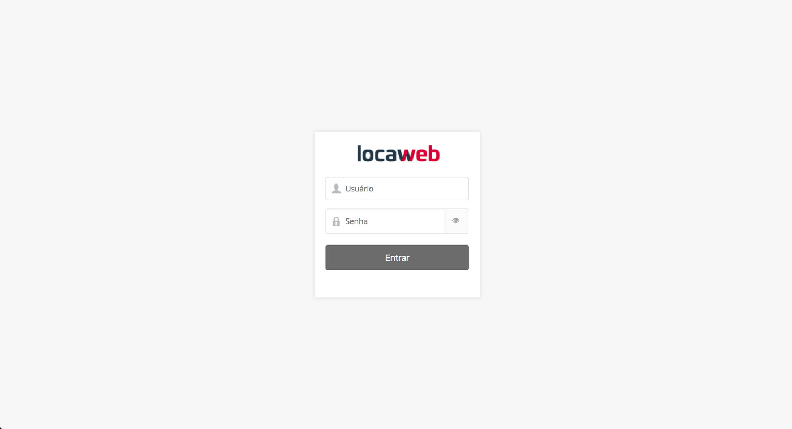

# Teste front-end Locaweb
O teste consiste em avaliar as habilidades com algumas tecnologias básicas no desenvolvimento front-end, tais como HTML, CSS e Javascript. Foque em propor uma solução com um design de código bem elaborado e preparado para o crescimento da aplicação.

Sinta-se livre para usar os frameworks, libs ou ferramentas que mais se sentir confortável, o que importa é a linha de raciocínio seguida ;)

## Problema a ser resolvido:
Para acessar os produtos da Locaweb o usuário precisa primeiramente realizar o login com seu email e senha cadastrados na hora da contratação dos mesmos. Esse formulário irá enviar um POST para uma API.

O endpoint usado para essa requisição é o `https://reqres.in/api/login` que deverá receber o seguinte payload por POST:

```JSON
{
  "email": "user@email.com",
  "password": "userpassword"
}
```

Ao realizar a requisição a API poderá retornar os seguintes estados:

**Caso o login seja autorizado:**
```
status: 200
body:
{
  "token": "user_token"
}
```

**Caso falte e-mail e/ou senha:**
```
status: 400
body:
{
  "error": "Some error message"
}
```

Sua aplicação deverá consultar essa rota e exibir as mensagens referentes ao resultado da requisição, ou seja:
- Caso o login seja realizado, o token é salvo de alguma maneira (cookie, local storage, etc...) e uma mensagem de sucesso é exibida.
- Caso haja algum problema ao realizar o login, a mensagem de erro recebida da API é exibida para o usuário.

Nossos designers desenvolveram um layout para essa tela usando o framework [Locawebstyle](http://opensource.locaweb.com.br/locawebstyle/), siga sua documentação para elaboração do design abaixo:
*(Todos os assets necessários encontram-se nesse repositório dentro da pasta `/assets/`)*

